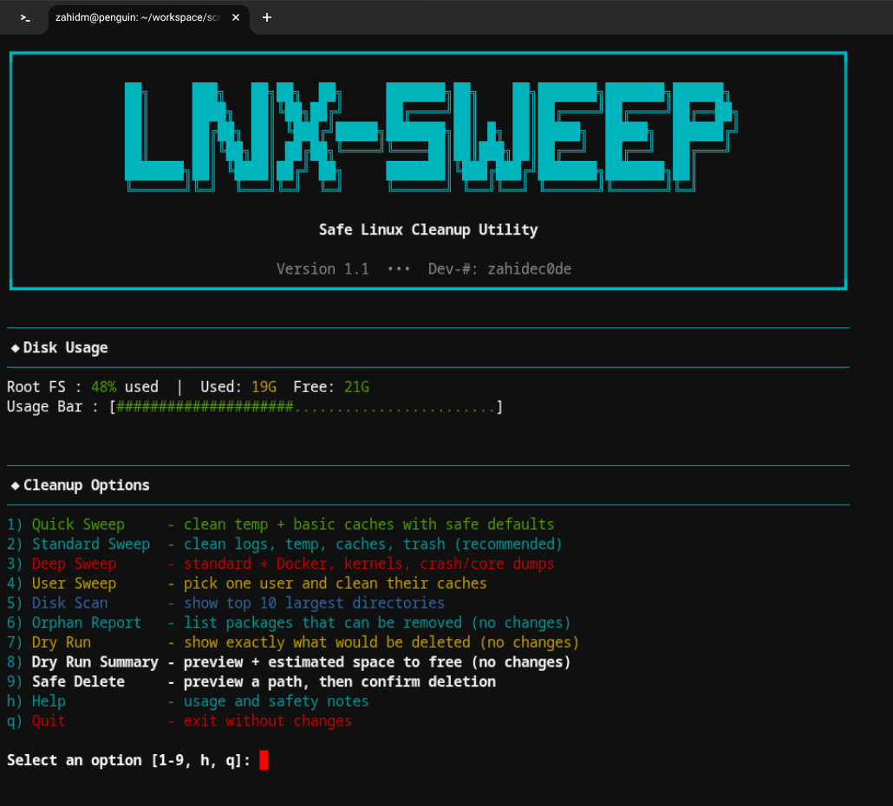

<div align="center">

# Lnx-Sweep


<div align="center">
Lnx-Sweep is a safe, preview-first cleanup utility for Debian-based Linux systems.  
It is designed to be explicit, transparent, and reliable when removing files.
</div>

</div>



<br>

**Lnx-Sweep helps you:**
- Clean caches, logs, temp files, and optional tool data safely
- Preview what will be deleted before any change
- Use a safe-delete flow instead of raw `rm -rf`
- Optionally move deletions to a backup folder instead of removing

## Get Started

### 1) Clone the repository

```bash
git clone https://github.com/zahidec0de/lnx-sweep.git
cd lnx-sweep
```

### 2) Make the script executable

```bash
chmod +x lnx-sweep.sh
```

### 3) Run

```bash
sudo ./lnx-sweep.sh
```

## Quick Start

```bash
sudo ./lnx-sweep.sh
```

## Modes (Main Actions)

| Mode | Purpose | What It Cleans |
|------|---------|----------------|
| `--quick` | Fast cleanup | Temp files + basic caches |
| `--standard` | Balanced cleanup | Logs, temp files, caches, trash |
| `--advanced` | Deep cleanup | Standard + Docker, kernels, crash/core dumps |
| `--user-only` | User cleanup | Current user caches (no root) |

## Safe Delete (Custom Path)

Safe Delete is designed to prevent accidental removals.  
It shows contents first, then asks for confirmation.

```bash
./lnx-sweep.sh --safe-delete /path/to/check
./lnx-sweep.sh --safe-rm "rm -r /path/to/check"
```

## Backup Mode (No Permanent Deletion)

When backup mode is enabled, files are moved into a backup folder
instead of being deleted.

```bash
sudo ./lnx-sweep.sh --backup --standard
```

## Preview Modes (No Changes)

| Option | Description |
|--------|-------------|
| `--dry-run` | Shows what would be deleted |
| `--dry-run-summary` | Shows what would be deleted + estimated space |
| `--plan` | Shows prompts and actions only (no execution) |

## Filters (Include / Exclude)

Limit what can be deleted:

```bash
./lnx-sweep.sh --exclude /var/log --standard
./lnx-sweep.sh --include "/home/*/.cache/*" --standard
```

## JSON Report

Get a machine-readable summary:

```bash
./lnx-sweep.sh --json-report --standard
./lnx-sweep.sh --json-report /tmp/lnx-sweep.json --standard
```

## Full Command Reference

| Option | Meaning |
|--------|---------|
| `--quick` | Fast cleanup with safe defaults |
| `--standard` | Balanced cleanup (recommended) |
| `--advanced` | Deep cleanup with Docker + kernels |
| `--user-only` | Clean current user caches (no root) |
| `--safe-delete PATH` | Inspect and confirm deletion of one path |
| `--safe-rm "rm -r /path"` | Parse rm command, then inspect + confirm |
| `--backup` | Move deletions into backup folder |
| `--dry-run` | Preview actions only |
| `--dry-run-summary` | Preview + estimated space |
| `--plan` | Show actions + prompts, run nothing |
| `--exclude PATH` | Skip deletions under PATH |
| `--include PATTERN` | Only delete matching paths |
| `--json-report [PATH]` | Print JSON summary or write to PATH |
| `--force` / `--yes` | Skip confirmations (dangerous) |
| `--no-color` | Disable colored output |
| `--help` | Show help info |

## What Gets Cleaned

| Category | Examples | Notes |
|----------|----------|-------|
| APT cache | Downloaded `.deb` files | Safe to re-download |
| APT lists | `/var/lib/apt/lists` | Requires `apt update` later |
| System logs | Rotated logs, old journal entries | Active logs preserved |
| Temporary files | `/tmp`, `/var/tmp` | Keeps active sockets/locks |
| User caches | Browser + app caches | Preserves user data |
| Trash | `~/.local/share/Trash/files` | Optional |
| Snap revisions | Disabled revisions | Ubuntu/Mint only |
| Pentest caches | Metasploit logs, Wireshark temp | Kali/Parrot only |
| Docker | Unused containers/images | Optional, explicit confirm |
| Kernels | Old kernel packages | Advanced mode |
| Crash/Core dumps | `/var/crash`, coredumps | Optional |

## Built-In Safety

- Critical system paths are blocked from deletion
- Safe Delete previews contents before confirmation
- Dry-run and plan modes show actions without changes
- Backup mode moves files instead of deleting them
- Confirmations required unless `--force` is used

## Supported Distributions

Debian and Debian-based systems


## License

MIT License
